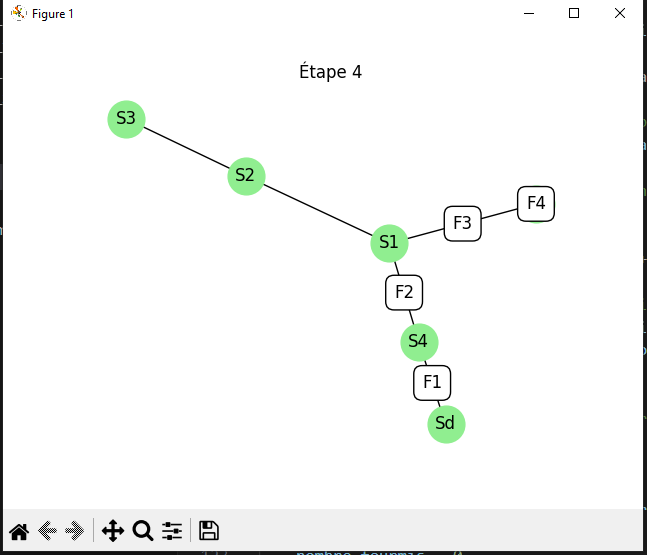

# Simulation of Ant Movement in an Anthill  
## Intial problem Statement  
We have a colony of F ants living in an underground anthill, which consists of rooms connected by tunnels. At night, all the ants gather in the vestibule (the entrance of the anthill) and then move to the dormitory. The tunnels connect various rooms of different sizes, and each room can only accommodate one ant at a time, unless otherwise specified.  
The challenge is to find an optimal sequence of movements that allows all ants to reach the dormitory as quickly as possible.  
## Solution
### Graph Representation
The anthill is modeled as a graph using the ``NetworkX`` library.  
Each room is represented as a node, and tunnels between rooms are edges.  
The class ``Anthill`` handles the addition of rooms and tunnels, and the adjacency matrix can be generated for visualization purposes.  
### Ant Movement
Each ant starts in the vestibule and follows the shortest path to the dormitory, found using ``shortest_path`` from ``NetworkX``.  
The class ``Simulation`` manages the movement of ants. In each step, ants move through adjacent rooms unless the room is occupied by another ant.  
### Step-by-Step Simulation  
The simulation calculates the movements of all ants in each step. Ants move from room to room as long as the destination is unoccupied.  
Movements are stored in a list and can be displayed either textually or graphically.  
### Visualization
The movements are visualized using ``Matplotlib``. Each step is animated, showing the ants moving from one room to another with annotations.  

 
## Conclusion
The problem of moving ants within an anthill is a classic graph traversal problem. The solution developed allows the anthill to be modeled as a graph, simulates the movements to minimize steps, and provides a graphical representation of the solution.

This project demonstrates the use of graph traversal algorithms and is capable of generating visualizations that represent the solution in an intuitive and educational manner.